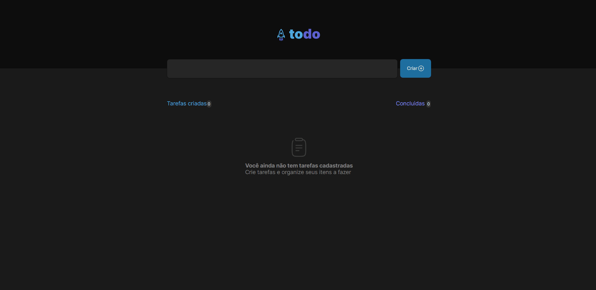

# Todo App

# 🚀 **Techs**

---

- [HTML](https://developer.mozilla.org/pt-BR/docs/Web/HTML)
- [CSS](https://www.w3schools.com/css/)
- [JavaScript](https://developer.mozilla.org/pt-BR/docs/Web/JavaScript)
- [React](https://pt-br.reactjs.org/)
- [SweetAlert2](https://sweetalert2.github.io/)

## Sobre

---

Aplicativo de lista de tarefas ToDo criado durante o Ignite da RocketSeat , este é o desafio 01 da triha React 2022*.*

### **Recursos:**

- [x]  Adicionar tarefa a  lista de tarefas
- [x]  Remover tarefa da lista de tarefas
- [x]  Validação de tarefas vazias com mensagem de erro usando [SweetAlert2](https://sweetalert2.github.io/)